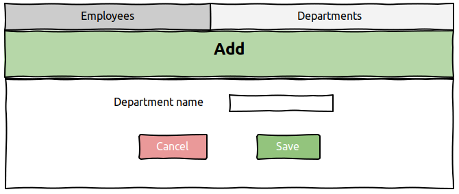

# Manager for department and employees

## Vision

This application is web-application that helps 
navigate in information about employees and 
departments. 

Application should provide:
* Storing information about employees and
departments in database;
* Display list of employees in department;
* Updating employees data (add,editing,delete);
* Display average cost of employees in a department;
* Display list of departments;
* Updating departments data (add,editing,delete);
* Filtering by date of birthday and period of dates.

## 1. Employees
### 1.1 Display list about employees
The mode is designed to view list of employees in department.
When user selects a department, a list of employees for that 
department appears **(pic 1.1)**.

#### *Main scenario*
* User select item Employees;
* Application open employees list.

**pic 1.1 - View the employees list**

The list displays the following columns:
* ID - identification employee number 
* Name - first and last employee name
* Date of birthday - employee's date of birthday
* Salary - employee salary
### 1.2 Search by date and period
For date search user have 2 mods.

#### *Main scenario*
1. Search by birthday:
   
   * User must uncheck **Period** and writes date
   * Click search and list will appear (pic 1.2).
   

**pic 1.2 - View the employees list by date**

2. Search by date period.

   * User must check **Period** and writes dates. 
   * Then click search and list will appear (pic 1.3).
   

**pic 1.3 - View the employees list by period**

For dropping date and period lists user can click button **Drop**.

### 1.3 Add employee

#### *Main scenario*
* User clicks button **Add**;
* Application displays form for adding;
* User enters information and presses **Save**;
* If all information is valid, then information is adding in DB;
* If don't all information is valid, then error message is displaying
  **(pic 1.5)**.

**pic 1.4 - View the form for adding**

**pic 1.5 - View the error message**

#### *Cancel operation scenario*
* User clicks button **Add**;
* Application displays form for adding;
* User clicks button **Cancel**;
* If user don't write information, then form will close;
* If user writes information and don't save, 
  then alert message is displaying **(pic 1.6)**.
  

**pic 1.6 - View the allert for editing**

### 1.4 Edit employee

#### *Main scenario*
* User clicks button **Edit**;
* Application displays form for editing;
* User edits information and presses **Save**;
* If all information is valid, then information is adding in DB;
* If don't all information is valid, then error message is displaying 
  **(pic 1.8)**.

**pic 1.7 - View the form for editing**

**pic 1.8 - View the error message for editing**

#### *Cancel operation scenario*
* User clicks button **Edit**;
* Application displays form for editing;
* User clicks button **Cancel**;
* If user don't change information, then form will close;
* If user change information and don't save, 
  then alert message is displaying.
  
### 1.5 Delete employee

#### *Main scenario*
* User clicks button **Delete** in employee's line in lists;
* An alert window will appear and ask if user want to delete;
* User clicks "Yes", then information about employee
will be deleted.
* If the program cannot delete the entry, then error message
will appear **(pic 1.9)**.
  
#### *Cancel operation scenario*
* User clicks button **Delete** in employee's line in lists;
* An alert window will appear and ask if user want to delete;
* User clicks "No", then information about employee
won't be deleted.

**pic 1.9 - View the form for deleting**
  

**pic 1.10 - View the form for deleting**
  
  
## 2. Departments
The mode is designed to view list of departments.
This mode works just for edit list of departments **(pic 2.1)**.

#### *Main scenario*
* User select item Departments;
* Application open departments list.

**pic 2.1 - View the departments list**

### 2.2 Add department

#### *Main scenario*
* User clicks button **Add**;
* Application displays form for adding;
* User enters information and presses **Save**;
* If all information is valid, then information is adding in DB;
* If don't all information is valid, then error message is displaying
  **(pic 2.3)**.

**pic 2.2 - View the form for adding**

**pic 2.3 - View the error message for adding**
#### *Cancel operation scenario*
* User clicks button **Add**;
* Application displays form for adding;
* User clicks button **Cancel**;
* If user don't write information, then form will close;
* If user writes information and don't save, 
  then alert message is displaying.

### 2.3 Edit department

#### *Main scenario*
* User clicks button **Edit**;
* Application displays form for editing;
* User edits information and presses **Save**;
* If all information is valid, then information is adding in DB;
* If don't all information is valid, then error message is displaying
  **(pic 2.5)**.

**pic 2.4 - View the form for editing**

**pic 2.5 - View the error message for editing**
#### *Cancel operation scenario*
* User clicks button **Edit**;
* Application displays form for editing;
* User clicks button **Cancel**;
* If user don't change information, then form will close;
* If user change information and don't save, 
  then alert message is displaying **(pic 2.6)**.
  

**pic 2.6 - View the alert for editing** 

### 2.4 Delete department

#### *Main scenario*
* User clicks button **Delete** in department's line in lists;
* An alert window will appear and ask if user want to delete;
* User clicks "Yes", then information about department
will be deleted;
* If the program cannot delete the entry, then error message
will appear **(pic 2.8)**.
  
#### *Cancel operation scenario*
* User clicks button **Delete** in department's line in lists;
* An alert window will appear and ask if user want to delete;
* User clicks "No", then window just will be closed and
information won't be deleted.

**pic 2.7 - View the form for deleting**
  

**pic 2.8 - View the error message for deleting**
